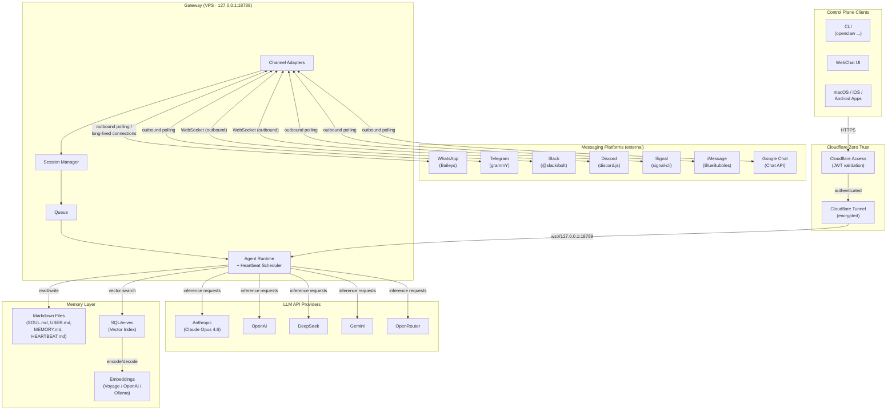

# Architecture Overview
{: .no_toc }

OpenClaw is an open-source persistent AI agent framework that acts as a **gateway and orchestration daemon**. It does not perform inference itself. Instead, it routes messages, manages memory, coordinates tool execution, and delegates all LLM inference to external API providers.

This page describes the high-level architecture, the core subsystems, and how they interact.

---

## Table of contents
{: .no_toc .text-delta }

1. TOC
{:toc}

---

## System Architecture Diagram



**Key distinction:** Messaging channels are reached via **outbound connections** from the gateway (polling, long-lived WebSockets). No inbound ports are needed for channels. Only control plane clients (CLI, WebChat UI, mobile apps) reach the gateway through the Cloudflare Tunnel + Access path.

---

## Core Subsystems

### 1. Channel Adapters

Channel adapters are the outermost layer of the gateway. Each supported messaging platform has a dedicated adapter that **initiates outbound connections** to the platform's API to poll for or receive messages. No inbound ports are needed for messaging — the gateway reaches out, not the other way around.

**Responsibilities:**

- **Poll or maintain outbound connections** to each platform's API (e.g., Telegram long-polling via grammY, WhatsApp persistent WebSocket via Baileys, Slack/Discord outbound WebSockets)
- Normalize incoming messages from all platforms into a **unified internal format**
- Serialize model output back into **platform-native format** for delivery (e.g., Telegram Markdown, Slack Block Kit, Discord embeds)
- Handle platform-specific media types (images, voice notes, documents, stickers)
- Manage connection lifecycle, reconnection, and authentication for each platform

{: .note }
> Webhooks (inbound HTTP callbacks) are **not used** because they would require exposing a port to the internet, breaking the Zero Trust model. All channel communication is outbound from the gateway.

Each adapter abstracts away the underlying library (Baileys for WhatsApp, grammY for Telegram, @slack/bolt for Slack, etc.) so that the rest of the system operates on a single, consistent message schema.

### 2. Session Manager

The session manager sits behind the channel adapters and is responsible for identifying who is communicating and maintaining conversational context.

**Responsibilities:**

- **Sender identification** -- map platform-specific user IDs to internal user records
- **Context management** -- maintain per-conversation state (history, active tools, pending responses)
- **DM vs. group chat handling** -- DMs from the same user across platforms are merged into a single primary session; group chats maintain multi-participant tracking with individual identity resolution
- **Session lifecycle** -- create, persist, and expire sessions based on activity

This subsystem ensures that the agent has a coherent understanding of who it is talking to and what the conversation history looks like, regardless of which channel the message arrived on.

### 3. Queueing Mechanism

The queue sits between the session manager and the agent runtime. Its primary job is to prevent race conditions when the agent is in the middle of a multi-step tool chain.

**Responsibilities:**

- **Hold incoming messages** while the agent runtime is actively executing a tool chain or waiting for an LLM response
- **Decide injection vs. queuing** -- determine whether a new message should be injected into the current generation (e.g., a correction or clarification) or held for the next turn
- **Prevent race conditions** -- ensure that concurrent messages from different channels or users do not corrupt the agent's execution state
- **Priority handling** -- allow urgent messages (e.g., from the operator) to preempt queued messages

### 4. Control Plane (Gateway)

The control plane is the central coordination hub. It runs a **WebSocket RPC server and HTTP server multiplexed on a single port** (default: `18789`).

**Responsibilities:**

- Expose the gateway API for external clients (CLI, WebChat UI, macOS/iOS/Android apps)
- Handle RPC calls for agent interaction, configuration, and status queries
- Multiplex WebSocket and HTTP on the same port for simplicity
- Serve as the entry point for `openclaw agent --message`, `openclaw status`, `openclaw dashboard`, and all other CLI commands

**Binding:**

The gateway **must** bind to `127.0.0.1` only. It is never exposed directly to the internet. External access is provided through Cloudflare Tunnel, which establishes an outbound-only encrypted connection from the VPS to Cloudflare Edge. See the [Security section](security.md) for full details.

```
CLI / WebChat UI / Mobile Apps
        |
        v
  Cloudflare Access (JWT validation)
        |
        v
  Cloudflare Tunnel (encrypted)
        |
        v
  ws://127.0.0.1:18789  (gateway)
```

### 5. Agent Runtime + Heartbeat Scheduler

The agent runtime is the core cognitive loop that processes messages and executes tool chains.

**Iterative cognitive loop:**

1. **Context assembly** -- gather conversation history, memory files, active tools, and system prompt
2. **LLM call** -- send the assembled context to the configured LLM provider (Anthropic, OpenAI, DeepSeek, Gemini, or OpenRouter)
3. **Tool execution** -- if the model response includes tool calls, execute them and collect results
4. **Repeat** -- feed tool results back into the context and call the LLM again until the model produces a final response with no further tool calls

The **heartbeat scheduler** runs alongside the agent runtime as a periodic autonomous trigger.

---

## How the Gateway Works

The gateway is the backbone of OpenClaw. It runs as a **systemd user service** on Linux (or launchd on macOS), ensuring automatic startup and restart on failure.

When a channel adapter picks up a new message (via outbound polling or a long-lived connection):

1. The **channel adapter** normalizes the raw platform message into the internal format
2. The **session manager** looks up or creates a session for the sender, loading relevant context
3. The **queue** checks whether the agent runtime is busy:
   - If idle, the message is forwarded immediately to the agent runtime
   - If busy (mid-tool-chain), the message is held in the queue
4. The **agent runtime** assembles context (conversation history + memory files + system prompt), sends it to the configured LLM, and processes the response
5. If the LLM response contains tool calls, the runtime executes them and loops back to step 4
6. Once the LLM produces a final text response, it is routed back through the channel adapter and delivered in the platform-native format

All of this happens internally on the VPS. Messaging channels never connect inbound — the gateway polls outbound. Only control plane clients (CLI, WebChat, mobile apps) reach the gateway via Cloudflare Tunnel at `openclaw.YOURDOMAIN.COM`.

```
Baileys adapter polls WhatsApp servers (outbound)
  -> New message detected
    -> Adapter normalizes into internal format
      -> Session Manager resolves sender identity
        -> Queue forwards to Agent Runtime
          -> Agent Runtime assembles context
            -> LLM API call (outbound to Anthropic / OpenAI / etc.)
              -> Tool execution (if needed)
                -> Final response
                  -> Channel Adapter formats for WhatsApp
                    -> Adapter sends reply via WhatsApp API (outbound)
```

---

## DM Security: Pairing Mode

By default, OpenClaw does **not** respond to messages from unknown senders. This prevents unauthorized access to the agent.

When a new, unrecognized sender sends a DM, the following flow occurs:

1. The agent detects that the sender is not in its approved contacts
2. The agent responds with a short **pairing code** (e.g., `CLAW-7X9K`)
3. The message content is **not processed** -- it is held until the sender is approved
4. The operator must explicitly approve the pairing from the CLI:

   ```bash
   openclaw pairing approve <channel> <code>
   ```

5. Once approved, the held message is processed and future messages from that sender are handled normally

This pairing mechanism acts as a gatekeeper that ensures only authorized users can interact with the agent. It applies per-channel, so a user approved on Telegram is not automatically approved on WhatsApp.

{: .warning }
> Pairing mode is a critical security feature. Disabling it exposes the agent to messages from anyone who can reach its channel accounts. Combined with the agent's ability to execute shell commands and access files, an unauthorized user could cause significant damage.

---

## Heartbeat Details

The heartbeat scheduler is a built-in autonomous trigger that allows the agent to perform proactive work without waiting for incoming messages.

**Configuration:**

| Parameter | Default | Description |
|-----------|---------|-------------|
| Interval | 30 minutes | How often the heartbeat fires (60 min with Anthropic OAuth) |
| Task source | `HEARTBEAT.md` | Markdown file listing pending async tasks |
| Active hours | Configurable | Timezone-aware window to prevent activity during off-hours |
| Discard threshold | 300 characters | Responses shorter than this are silently discarded |

**How it works:**

1. Every 30 minutes, the heartbeat scheduler triggers an agent turn
2. The agent reads `HEARTBEAT.md` to check for pending tasks (e.g., "check deployment status", "send daily summary", "review open PRs")
3. The agent processes any pending tasks and produces a response
4. **If the response is only `HEARTBEAT_OK`** (or the content is fewer than 300 characters after removing the heartbeat token), the response is **silently discarded** -- no message is sent to any channel
5. If the response exceeds 300 characters, it is delivered to the configured notification channel

This mechanism allows the agent to autonomously monitor systems, send reminders, and perform background work while avoiding unnecessary noise when there is nothing to report.

**Example `HEARTBEAT.md`:**

```markdown
# Heartbeat Tasks

- [ ] Check if deployment at openclaw.YOURDOMAIN.COM is healthy
- [ ] Review any new GitHub issues in the project repo
- [ ] Send a daily summary to Telegram if it is 9:00 AM in the operator's timezone
```

The agent processes these tasks on each heartbeat cycle, checks off completed items, and adds new ones as needed.
