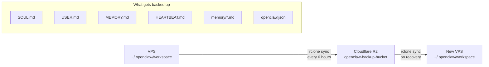

# Backup & Recovery
{: .no_toc }

Your agent's identity, memory, and configuration live in `~/.openclaw/`. Regular backups to Cloudflare R2 (S3-compatible, zero egress fees) ensure full recovery on any new VPS.
{: .fs-6 .fw-300 }

## Table of contents
{: .no_toc .text-delta }

1. TOC
{:toc}

---

## Overview

Everything that makes your OpenClaw agent _yours_ -- its personality (`SOUL.md`), knowledge of you (`USER.md`), long-term memory (`MEMORY.md`), daily logs, and gateway configuration -- is stored under `~/.openclaw/`. If the VPS is lost, a fresh backup restores the full agent identity in minutes.

Cloudflare R2 is the recommended backup target because it is S3-compatible, has **zero egress fees**, and pairs naturally with the Cloudflare infrastructure already in use for the tunnel and Zero Trust access.

---

## Backup Flow



The sync is **incremental** -- only changed files are transferred on each run.

---

## Install rclone

```bash
sudo -v ; curl https://rclone.org/install.sh | sudo bash
```

Verify the installation:

```bash
rclone version
```

---

## Configure R2 Remote

Run the interactive configuration wizard:

```bash
rclone config
```

Create a new remote named `r2` with these settings:

| Setting | Value |
|:--------|:------|
| Name | `r2` |
| Type | Amazon S3 Compliant Storage Providers (`s3`) |
| Provider | Cloudflare |
| Access Key ID | _(from Cloudflare dashboard > R2 > Manage R2 API Tokens)_ |
| Secret Access Key | _(from the same token creation flow)_ |
| Endpoint | `https://YOUR_ACCOUNT_ID.r2.cloudflarestorage.com` |

Replace `YOUR_ACCOUNT_ID` with your Cloudflare account ID, visible in the R2 section of the Cloudflare dashboard.

Leave all other settings at their defaults.

{: .note }
> The R2 API tokens are separate from your global Cloudflare API key. Create a dedicated token with **Object Read & Write** permissions scoped to the backup bucket.

---

## Create the R2 Bucket

Create the bucket via the **Cloudflare dashboard** (Storage & Databases > R2 > Create bucket) or using the Wrangler CLI:

```bash
npx wrangler r2 bucket create openclaw-backup-bucket
```

Verify `rclone` can see the bucket:

```bash
rclone lsd r2:
```

You should see `openclaw-backup-bucket` in the listing.

---

## Set Up Automatic Sync

Schedule a cron job to sync every 6 hours:

```bash
crontab -e
```

Add the following line:

```
0 */6 * * * rclone sync /home/YOUR_USER/.openclaw/workspace r2:openclaw-backup-bucket --log-file=/tmp/rclone-openclaw.log --log-level=INFO
```

Replace `YOUR_USER` with your Linux username.

Verify the cron entry was saved:

```bash
crontab -l
```

{: .tip }
> Check `/tmp/rclone-openclaw.log` after the first scheduled run to confirm syncs are succeeding. Common issues include expired R2 API tokens or incorrect endpoint URLs.

---

## Manual Backup

Run a one-off sync at any time:

```bash
rclone sync ~/.openclaw/workspace r2:openclaw-backup-bucket
```

Add `--dry-run` first to preview what would be transferred without making changes:

```bash
rclone sync ~/.openclaw/workspace r2:openclaw-backup-bucket --dry-run
```

---

## Recovery Procedure

If you need to restore your agent on a new VPS, follow these steps in order:

### 1. Provision a new VPS

Follow the [VPS Provisioning](vps-provisioning.md) guide to set up Ubuntu 24.04 with UFW and SSH access.

### 2. Install dependencies

Install Node.js 22+, `cloudflared`, and OpenClaw following the [Runtime Dependencies](runtime-deps.md) and [Install OpenClaw](install-openclaw.md) guides. **Do not run `openclaw onboard` yet.**

### 3. Install and configure rclone

```bash
sudo -v ; curl https://rclone.org/install.sh | sudo bash
rclone config
```

Re-create the `r2` remote using the same R2 API credentials as the original VPS.

### 4. Pull the backup

```bash
rclone sync r2:openclaw-backup-bucket ~/.openclaw/workspace
```

Verify the files are in place:

```bash
ls ~/.openclaw/workspace/
```

You should see `SOUL.md`, `USER.md`, `MEMORY.md`, `HEARTBEAT.md`, and any other workspace files.

### 5. Run onboarding

```bash
openclaw onboard --install-daemon
```

The wizard will detect the existing workspace and configuration files. Confirm the settings match your previous deployment (bind `127.0.0.1`, port `18789`).

### 6. Reconfigure the Cloudflare Tunnel

The tunnel credentials are tied to the original VPS. On the new VPS, either:

- **Re-create the tunnel** and update DNS routes (see [Cloudflare Tunnel](cloudflare-tunnel.md))
- **Copy the tunnel credentials** (`~/.cloudflared/YOUR_TUNNEL_UUID.json` and `cert.pem`) from a separate backup, then update `~/.cloudflared/config.yml` with the correct paths

### 7. Verify

```bash
openclaw doctor
openclaw status
systemctl status cloudflared
```

All three commands should report healthy status. Your agent is fully restored.

---

{: .note-title }
> **Claude Code Prompt**
>
> Copy this into Claude Code:
> ```
> SSH into my VPS "openclaw" and set up automated backups:
> 1. Install rclone
> 2. Configure an R2 remote named "r2" (I'll provide the access keys)
> 3. Verify the bucket is accessible: rclone lsd r2:
> 4. Set up a cron job to sync every 6 hours:
>    rclone sync ~/.openclaw/workspace r2:openclaw-backup-bucket
>    with logging to /tmp/rclone-openclaw.log
> 5. Run an initial manual sync to verify it works
> 6. Show me the cron entry and sync results
> ```
