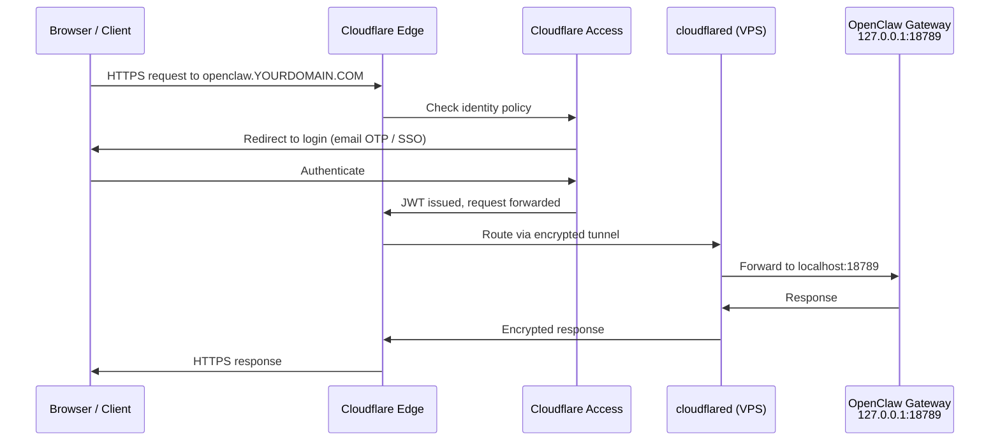

# Cloudflare Tunnel
{: .no_toc }

Set up an encrypted, outbound-only connection from your VPS to Cloudflare Edge so the OpenClaw gateway never needs to expose a port to the internet.

---

## Table of contents
{: .no_toc .text-delta }

1. TOC
{:toc}

---

## What is a Cloudflare Tunnel?

A Cloudflare Tunnel is an **outbound-only encrypted connection** from your VPS to Cloudflare's edge network. Unlike traditional reverse proxies that require you to open inbound ports and accept connections from the internet, a tunnel works in the opposite direction: the `cloudflared` daemon on your VPS initiates a persistent connection _out_ to Cloudflare. All traffic flows through Cloudflare's network and is never routed directly to your server.

This means:

- **No inbound ports** need to be opened in your firewall (UFW keeps denying everything except SSH)
- **No public IP exposure** -- the gateway at `127.0.0.1:18789` remains bound to localhost
- **Automatic TLS** -- Cloudflare handles certificate provisioning and renewal
- **DDoS protection** -- traffic is scrubbed at Cloudflare's edge before it ever reaches your VPS
- **Identity-aware access** -- combined with Cloudflare Access, every request is authenticated before it is forwarded through the tunnel

The `cloudflared` daemon is the only component that bridges the gap between Cloudflare's edge and your local services. It runs as a systemd service and automatically reconnects if the connection drops.

---

## Zero Trust Request Flow

The following diagram shows the complete path a request takes from a user's browser to the OpenClaw gateway and back, passing through Cloudflare Access authentication and the encrypted tunnel.



Every request must pass through Cloudflare Access before it reaches the tunnel. If the user does not have a valid JWT, the request is rejected at Cloudflare's edge and never reaches your VPS.

---

## Authenticate cloudflared

Before creating a tunnel, you must authorize the `cloudflared` daemon with your Cloudflare account:

```bash
cloudflared tunnel login
```

This opens a browser window where you select the Cloudflare zone (domain) you want to use. After authorization, `cloudflared` stores a certificate at `~/.cloudflared/cert.pem` that grants it permission to create tunnels and manage DNS for the selected zone.

{: .warning }
> The `cert.pem` file grants full tunnel management access to your Cloudflare zone. Protect it with appropriate file permissions (`chmod 600`) and never commit it to version control.

---

## Create the Tunnel

Create a named tunnel that will route traffic to your OpenClaw gateway:

```bash
cloudflared tunnel create openclaw-gateway
```

This command outputs a **tunnel UUID** (e.g., `a1b2c3d4-e5f6-7890-abcd-ef1234567890`) and creates a credentials file at `~/.cloudflared/YOUR_TUNNEL_UUID.json`. Note the UUID -- you will need it for the configuration file in the next step.

You can verify the tunnel was created:

```bash
cloudflared tunnel list
```

---

## Write the Tunnel Config

Create the configuration file at `~/.cloudflared/config.yml`:

```yaml
tunnel: YOUR_TUNNEL_UUID
credentials-file: /home/YOUR_USER/.cloudflared/YOUR_TUNNEL_UUID.json

ingress:
  - hostname: openclaw.YOURDOMAIN.COM
    service: http://localhost:18789
  - hostname: ssh.YOURDOMAIN.COM
    service: ssh://localhost:22
  - service: http_status:404
```

Replace the placeholders:

| Placeholder | Replace with |
|:------------|:-------------|
| `YOUR_TUNNEL_UUID` | The UUID from `cloudflared tunnel create` |
| `YOUR_USER` | Your Linux username (e.g., `deploy`) |
| `YOURDOMAIN.COM` | Your actual domain managed by Cloudflare |

The `ingress` rules are evaluated top-to-bottom:

1. Requests to `openclaw.YOURDOMAIN.COM` are forwarded to the OpenClaw gateway on `localhost:18789`
2. Requests to `ssh.YOURDOMAIN.COM` are forwarded to the SSH daemon on `localhost:22` (useful for browser-based SSH via Cloudflare Access)
3. Any other request receives a `404` response (catch-all rule, required by `cloudflared`)

{: .note }
> The catch-all `http_status:404` rule at the end is mandatory. `cloudflared` will refuse to start without it.

---

## Route DNS

Create CNAME records in Cloudflare DNS that point your hostnames to the tunnel:

```bash
cloudflared tunnel route dns openclaw-gateway openclaw.YOURDOMAIN.COM
cloudflared tunnel route dns openclaw-gateway ssh.YOURDOMAIN.COM
```

Each command creates a CNAME record for the hostname pointing to `YOUR_TUNNEL_UUID.cfargotunnel.com`. You can verify the records in the Cloudflare dashboard under **DNS > Records** for your zone.

---

## Install as systemd Service

Install `cloudflared` as a system-level service so it starts automatically on boot and restarts on failure:

```bash
sudo cloudflared service install
sudo systemctl start cloudflared
sudo systemctl enable cloudflared
```

This copies your tunnel configuration to `/etc/cloudflared/config.yml` and creates a systemd unit file. The service runs as root by default, which is required for binding to privileged ports if you add SSH tunnel support.

---

## Verify the Tunnel

Confirm the tunnel is running and healthy:

```bash
systemctl status cloudflared
cloudflared tunnel info openclaw-gateway
```

You should see:

- `systemctl status` reporting `active (running)` with no errors in the journal
- `tunnel info` showing at least one active connection to a Cloudflare data center

Test end-to-end connectivity by visiting `https://openclaw.YOURDOMAIN.COM` in your browser. If Cloudflare Access is configured, you will be prompted to authenticate before the request reaches the gateway.

{: .claude }
> Copy this into Claude Code to set up your Cloudflare Tunnel:
> ```
> I need to set up a Cloudflare Tunnel on my VPS to securely expose
> the OpenClaw gateway at localhost:18789. My domain is managed by
> Cloudflare. Walk me through creating the tunnel, writing the config,
> routing DNS, and installing it as a systemd service.
> ```
