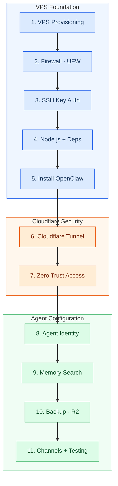
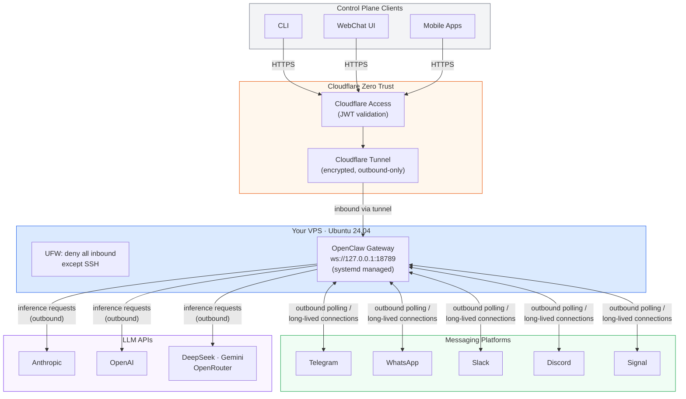

# OpenClaw VPS Deployment Guide
{: .fs-9 }

Deploy a persistent AI agent on your own VPS with Cloudflare Zero Trust security -- from bare metal to production in one session.
{: .fs-6 .fw-300 }

---

## What is OpenClaw?

OpenClaw is **not** an inference engine. It is an open-source **gateway and orchestration daemon** that routes messages, manages memory, and coordinates tool execution across messaging platforms. All LLM inference happens externally via API calls to providers like Anthropic (Claude Opus 4.6), OpenAI, DeepSeek, Gemini, and OpenRouter.

Think of it as a persistent control plane for your AI agent: it stays running on a server, receives messages from WhatsApp, Telegram, Slack, Discord, Signal, and other channels, then orchestrates responses through the LLM provider of your choice.

| Detail | Value |
|:-------|:------|
| Creator | Peter Steinberger |
| License | MIT |
| Language | TypeScript |
| GitHub Stars | 199,000+ |
| npm Package | `openclaw` (versioning: `YYYY.M.D`) |
| Gateway Port | `18789` (localhost only, never exposed) |
| Recommended Specs | 4 vCPU, 8 GB RAM, Ubuntu 24.04 LTS |
| Repository | [github.com/openclaw/openclaw](https://github.com/openclaw/openclaw) |
| Documentation | [docs.openclaw.ai](https://docs.openclaw.ai/) |

---

## What This Guide Covers

This guide walks you through deploying OpenClaw on a fresh Ubuntu 24.04 VPS with a complete Cloudflare Zero Trust security layer. By the end, you will have:

- A running OpenClaw gateway daemon managed by systemd
- Cloudflare Tunnel providing encrypted, outbound-only connectivity (no inbound ports)
- Cloudflare Access enforcing identity-aware authentication before any request reaches your VPS
- Agent identity files (`SOUL.md`, `USER.md`, `MEMORY.md`) configured for your use case
- Hybrid semantic + lexical memory search enabled
- Automated backups to Cloudflare R2
- At least one messaging channel connected and tested

---

## Deployment Pipeline

The full deployment follows these eleven steps in order:



**Color key:** Blue = VPS foundation | Orange = Cloudflare security | Green = Agent configuration

---

## Quick Start Path

Follow the pages in order for a complete deployment:

| Step | Page | What You Do |
|:-----|:-----|:------------|
| 1 | [VPS Provisioning](vps-provisioning.md) | Spin up Ubuntu 24.04 VPS, create non-root user, configure UFW firewall |
| 2 | [SSH Key Authentication](ssh-keys.md) | Set up key-only SSH access, disable password auth, install fail2ban |
| 3 | [Runtime Dependencies](runtime-deps.md) | Install build tools, Node.js 22 via NVM, and `cloudflared` |
| 4 | [Install OpenClaw](install-openclaw.md) | `npm install -g openclaw@latest && openclaw onboard --install-daemon` |
| 5 | [Cloudflare Tunnel](cloudflare-tunnel.md) | Create a tunnel routing `openclaw.YOURDOMAIN.COM` to `localhost:18789` |
| 6 | [Zero Trust Access](zero-trust-access.md) | Create a Cloudflare Access application with email-based Allow policy |
| 7 | [SSH via Zero Trust](ssh-access.md) | Configure SSH access through the tunnel (3 options) |
| 8 | [Agent Identity](agent-identity.md) | Write `SOUL.md`, `USER.md`, `MEMORY.md`, and `HEARTBEAT.md` |
| 9 | [Memory Search](memory-search.md) | Enable hybrid semantic + lexical search in `openclaw.json` |
| 10 | [Backup to R2](backup-recovery.md) | Configure `rclone` to sync workspace to Cloudflare R2 every 6 hours |
| 11 | [Channels & Testing](messaging-channels.md) | Connect messaging channels, test pairing mode, verify end-to-end |

---

## Architecture at a Glance

Once deployed, your setup has two traffic paths — **all outbound from the VPS**:



**No inbound ports are open for messaging.** The gateway polls channel APIs outbound (Telegram long-polling, WhatsApp persistent WebSocket, etc.). Only control plane clients reach the gateway through the Cloudflare Tunnel path.

---

## Prerequisites

Before starting, make sure you have:

- A **VPS** with Ubuntu 24.04 LTS (Hetzner, DigitalOcean, or similar; 4 vCPU / 8 GB RAM recommended)
- A **domain name** with DNS managed by Cloudflare (e.g., `YOURDOMAIN.COM`)
- A **Cloudflare account** (free tier is sufficient for Tunnels and Access)
- An **API key** for at least one LLM provider (Anthropic, OpenAI, etc.), or an **Anthropic Max** subscription
- **SSH access** to your VPS

---

{: .note-title }
> **Claude Code Prompt**
>
> Copy this into Claude Code to get started:
> ```
> I want to deploy OpenClaw on a fresh Ubuntu 24.04 VPS with
> Cloudflare Zero Trust security. I'm starting from scratch.
> Guide me step by step through the entire process:
> 1. Choosing and provisioning a VPS (Hetzner or DigitalOcean)
> 2. Setting up a domain with Cloudflare DNS
> 3. Hardening the server (firewall, SSH keys, fail2ban)
> 4. Installing Node.js and OpenClaw
> 5. Creating a Cloudflare Tunnel and Zero Trust Access policy
> 6. Configuring the agent identity and memory
> 7. Connecting messaging channels and testing
> Ask me questions as we go — I'll provide credentials and
> make choices when needed.
> ```

---

[Get started with Prerequisites](prerequisites.md){: .btn .btn-primary .fs-5 .mb-4 .mb-md-0 .mr-2 }
[View on GitHub](https://github.com/openclaw/openclaw){: .btn .fs-5 .mb-4 .mb-md-0 }
