# OpenClaw VPS Deployment Guide
{: .fs-9 }

Deploy a persistent AI agent on your own VPS with Cloudflare Zero Trust security -- from bare metal to production in one session.
{: .fs-6 .fw-300 }

---

## What is OpenClaw?

OpenClaw is **not** an inference engine. It is an open-source **gateway and orchestration daemon** that routes messages, manages memory, and coordinates tool execution across messaging platforms. All LLM inference happens externally via API calls to providers like Anthropic (Claude Opus 4.6), OpenAI, DeepSeek, Gemini, and OpenRouter.

Think of it as a persistent control plane for your AI agent: it stays running on a server, receives messages from WhatsApp, Telegram, Slack, Discord, Signal, and other channels, then orchestrates responses through the LLM provider of your choice.

| Detail | Value |
|:-------|:------|
| Creator | Peter Steinberger |
| License | MIT |
| Language | TypeScript |
| GitHub Stars | 199,000+ |
| npm Package | `openclaw` (versioning: `YYYY.M.D`) |
| Gateway Port | `18789` (localhost only, never exposed) |
| Min Specs | 2 vCPU, 2 GB RAM, Ubuntu 24.04 LTS |
| Repository | [github.com/openclaw/openclaw](https://github.com/openclaw/openclaw) |
| Documentation | [docs.openclaw.ai](https://docs.openclaw.ai/) |

---

## What This Guide Covers

This guide walks you through deploying OpenClaw on a fresh Ubuntu 24.04 VPS with a complete Cloudflare Zero Trust security layer. By the end, you will have:

- A running OpenClaw gateway daemon managed by systemd
- Cloudflare Tunnel providing encrypted, outbound-only connectivity (no inbound ports)
- Cloudflare Access enforcing identity-aware authentication before any request reaches your VPS
- Agent identity files (`SOUL.md`, `USER.md`, `MEMORY.md`) configured for your use case
- Hybrid semantic + lexical memory search enabled
- Automated backups to Cloudflare R2
- At least one messaging channel connected and tested

---

## Deployment Pipeline

The full deployment follows these ten steps in order:

```mermaid
flowchart LR
    A["1. VPS\nProvisioning"] --> B["2. Firewall\n(UFW)"]
    B --> C["3. Node.js +\nDependencies"]
    C --> D["4. Install\nOpenClaw"]
    D --> E["5. Cloudflare\nTunnel"]
    E --> F["6. Zero Trust\nAccess"]
    F --> G["7. Agent\nIdentity"]
    G --> H["8. Memory\nSearch"]
    H --> I["9. Backup\n(R2)"]
    I --> J["10. Channels\n& Testing"]

    style A fill:#60a5fa,stroke:#93c5fd,color:#000
    style B fill:#60a5fa,stroke:#93c5fd,color:#000
    style C fill:#60a5fa,stroke:#93c5fd,color:#000
    style D fill:#60a5fa,stroke:#93c5fd,color:#000
    style E fill:#fb923c,stroke:#fdba74,color:#000
    style F fill:#fb923c,stroke:#fdba74,color:#000
    style G fill:#4ade80,stroke:#86efac,color:#000
    style H fill:#4ade80,stroke:#86efac,color:#000
    style I fill:#4ade80,stroke:#86efac,color:#000
    style J fill:#4ade80,stroke:#86efac,color:#000
```



**Color key:** Blue = VPS foundation | Orange = Cloudflare security | Green = Agent configuration

---

## Quick Start Path

Follow the pages in order for a complete deployment:

| Step | Page | What You Do |
|:-----|:-----|:------------|
| 1 | [VPS Provisioning](vps-provisioning.md) | Spin up Ubuntu 24.04 VPS, create non-root user, configure UFW firewall |
| 2 | [Runtime Dependencies](runtime-deps.md) | Install build tools, Node.js 22 via NVM, and `cloudflared` |
| 3 | [Install OpenClaw](install-openclaw.md) | `npm install -g openclaw@latest && openclaw onboard --install-daemon` |
| 4 | [Cloudflare Tunnel](cloudflare-tunnel.md) | Create a tunnel routing `openclaw.YOURDOMAIN.COM` to `localhost:18789` |
| 5 | [Zero Trust Access](zero-trust-access.md) | Create a Cloudflare Access application with email-based Allow policy |
| 6 | [SSH via Zero Trust](ssh-access.md) | Configure SSH access through the tunnel (3 options) |
| 7 | [Agent Identity](agent-identity.md) | Write `SOUL.md`, `USER.md`, `MEMORY.md`, and `HEARTBEAT.md` |
| 8 | [Memory Search](memory-search.md) | Enable hybrid semantic + lexical search in `openclaw.json` |
| 9 | [Backup to R2](backup-recovery.md) | Configure `rclone` to sync workspace to Cloudflare R2 every 6 hours |
| 10 | [Channels & Testing](messaging-channels.md) | Connect messaging channels, test pairing mode, verify end-to-end |

---

## Architecture at a Glance

Once deployed, your setup looks like this:

```
Users (WhatsApp / Telegram / Slack / Discord / Signal / ...)
                        |
                        v
            Cloudflare Access (JWT)
                        |
                        v
            Cloudflare Tunnel (encrypted, outbound-only)
                        |
                        v
         +---------------------------------+
         |  Your VPS (Ubuntu 24.04)        |
         |                                 |
         |   UFW: deny all inbound         |
         |   except SSH (port 22)          |
         |                                 |
         |   OpenClaw Gateway              |
         |   ws://127.0.0.1:18789          |
         |   (systemd managed)             |
         +---------------------------------+
                        |
                        v
            LLM APIs (Anthropic, OpenAI, etc.)
```

---

## Prerequisites

Before starting, make sure you have:

- A **VPS** with Ubuntu 24.04 LTS (Hetzner, DigitalOcean, or similar; 2 vCPU / 2 GB RAM minimum)
- A **domain name** with DNS managed by Cloudflare (e.g., `YOURDOMAIN.COM`)
- A **Cloudflare account** (free tier is sufficient for Tunnels and Access)
- An **API key** for at least one LLM provider (Anthropic, OpenAI, etc.)
- **SSH access** to your VPS

---

{: .note-title }
> **Claude Code Prompt**
>
> Copy this into Claude Code to get started:
> ```
> I want to deploy OpenClaw on a fresh Ubuntu 24.04 VPS with
> Cloudflare Zero Trust security. Walk me through the full setup
> starting from VPS provisioning.
> ```

---

[Get started with Prerequisites](prerequisites.md){: .btn .btn-primary .fs-5 .mb-4 .mb-md-0 .mr-2 }
[View on GitHub](https://github.com/openclaw/openclaw){: .btn .fs-5 .mb-4 .mb-md-0 }
