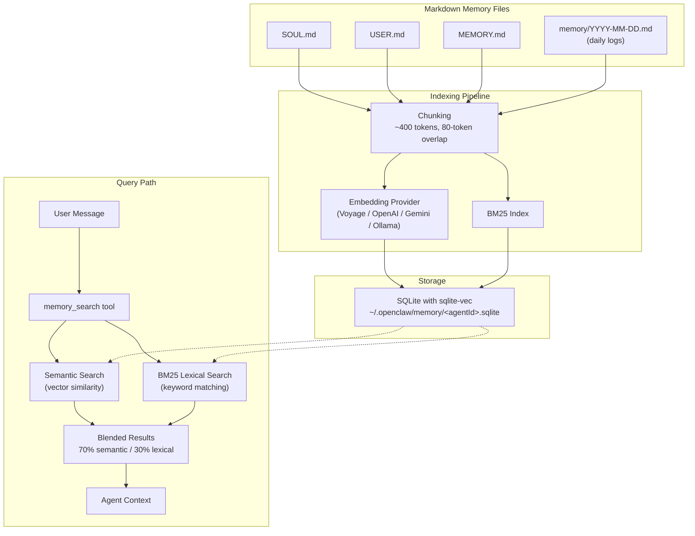

# Hybrid Memory Search
{: .no_toc }

<details open markdown="block">
  <summary>Table of contents</summary>
  {: .text-delta }
1. TOC
{:toc}
</details>

---

## Overview

OpenClaw combines **semantic search** (dense vector embeddings) with **lexical search** (BM25 keyword matching) for comprehensive memory recall. This hybrid approach ensures that both conceptual similarity and exact keyword matches are surfaced when the agent queries its memory.

The default blend ratio is **70% semantic / 30% lexical**. Semantic search excels at finding conceptually related content even when the wording differs, while BM25 lexical search is critical for exact matches on code snippets, error messages, names, and identifiers.

---

## Memory Architecture Diagram



---

## Enable Memory Search

Edit `~/.openclaw/openclaw.json` to enable hybrid memory search:

```json
{
  "memorySearch": {
    "enabled": true,
    "provider": "voyage",
    "sources": ["memory", "sessions"],
    "indexMode": "hot",
    "minScore": 0.3,
    "maxResults": 20
  }
}
```

{: .important }
> After enabling or changing memory search settings, you must restart the OpenClaw daemon for the changes to take effect. See [Restart After Configuration](#restart-after-configuration) below.

---

## Configuration Options

| Setting | Description | Default |
|:--------|:------------|:--------|
| `enabled` | Enable or disable memory search entirely. | `false` |
| `provider` | Embedding provider to use: `voyage`, `openai`, `gemini`, `ollama`, or `node-llama-cpp`. | `"voyage"` |
| `sources` | What content to index. `"memory"` indexes Markdown files; `"sessions"` indexes conversation logs. | `["memory", "sessions"]` |
| `indexMode` | Set to `"hot"` to cache embeddings and skip re-vectorizing unchanged text. Reduces API costs and indexing time. | `"hot"` |
| `minScore` | Minimum similarity score (0.0 to 1.0) a result must meet to be included. Lower values return more results; higher values increase precision. | `0.3` |
| `maxResults` | Maximum number of results returned per query. | `20` |

---

## Embedding Providers

| Provider | Type | Model | Notes |
|:---------|:-----|:------|:------|
| **Voyage** | Cloud API | Voyage AI embeddings | Recommended default. High quality, purpose-built for retrieval. Requires `VOYAGE_API_KEY`. |
| **OpenAI** | Cloud API | `text-embedding-3-small` / `text-embedding-3-large` | Widely available. Requires `OPENAI_API_KEY`. |
| **Gemini** | Cloud API | Gemini embedding models | Good option if already using Google AI. Requires `GOOGLE_API_KEY`. |
| **Ollama** | Local | Various (e.g., `nomic-embed-text`, `mxbai-embed-large`) | Fully offline, no API key needed. Requires Ollama running locally. Higher latency but complete data privacy. |
| **node-llama-cpp** | Local | GGUF embedding models | Embedded inference, no external process needed. Good for air-gapped deployments. |

{: .note }
> For VPS deployments without a GPU, Voyage or OpenAI are the recommended providers. Local providers like Ollama work well on machines with sufficient CPU resources but will have higher latency for large memory sets.

---

## Memory Tools

The agent has access to the following tools for interacting with its memory:

| Tool | Function |
|:-----|:---------|
| `memory_search` | Semantic recall over indexed Markdown chunks. Uses the hybrid search pipeline (vector similarity + BM25). |
| `memory_get` | Read a specific Markdown file or a line range within a file. |
| `memory_store` | Explicitly save facts to memory. Written to Markdown files on disk. |
| `memory_list` | View all stored memories and memory files. |
| `memory_forget` | Delete specific memories or memory entries. |

These tools are available to the agent during conversation and heartbeat turns. The agent decides autonomously when to search, store, or forget information based on context.

---

## Restart After Configuration

Always restart the OpenClaw daemon after changing memory search settings:

```bash
systemctl --user restart openclaw
```

Verify the service is running:

```bash
systemctl --user status openclaw
```

You can also confirm memory search is active by checking the gateway logs:

```bash
journalctl --user -u openclaw -f
```

Look for log lines indicating the embedding provider has been initialized and the memory index is being built.

---

## Alternative: Mem0 Plugin

For deployments that require a dedicated vector database backend, the `@mem0/openclaw-mem0` plugin provides integration with **Qdrant** and **Milvus**.

Install the plugin:

```bash
npm install -g @mem0/openclaw-mem0
```

Configure in `~/.openclaw/openclaw.json`:

```json
{
  "plugins": ["@mem0/openclaw-mem0"],
  "mem0": {
    "mode": "open-source",
    "vectorStore": "qdrant",
    "qdrantUrl": "http://localhost:6333"
  }
}
```

Setting `"mode": "open-source"` uses the self-hosted Mem0 backend with your own Qdrant or Milvus instance, keeping all data under your control. This is suitable for enterprise deployments that need horizontal scaling or already operate a vector database cluster.

---

{: .note-title }
> **Claude Code Prompt**
>
> Copy this into Claude Code:
> ```
> SSH into my VPS "openclaw" and enable hybrid memory search:
> 1. Check if VOYAGE_API_KEY is set in the environment
>    (in the systemd service or openclaw.json). If not, ask me for the key.
> 2. Edit ~/.openclaw/openclaw.json and add memorySearch config:
>    enabled: true, provider: voyage, sources: ["memory", "sessions"],
>    indexMode: hot, minScore: 0.3, maxResults: 20
> 3. Restart the daemon: systemctl --user restart openclaw
> 4. Verify it restarted: systemctl --user status openclaw
> 5. Check logs for memory indexing: journalctl --user -u openclaw --no-pager -n 20
>    Look for errors about missing API keys or failed embedding.
> ```
