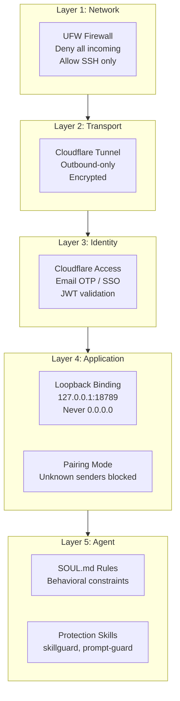

# Security Hardening
{: .no_toc }

## Table of contents
{: .no_toc .text-delta }

1. TOC
{:toc}

---

## Overview

OpenClaw has drawn significant security scrutiny from major security firms including Cisco, CrowdStrike, Bitsight, Sophos, 1Password, and Aikido. Because the agent can execute shell commands, modify files, and send messages on your behalf, a compromised gateway is far worse than a compromised web application. Defense-in-depth is essential --- every layer must assume the layers above it have failed.

## Defense-in-Depth Diagram

The following diagram illustrates the five security layers that protect an OpenClaw deployment:



Each layer operates independently. Even if an attacker bypasses one layer, the remaining layers continue to protect the system.

## Known Threats

Real security issues that have been discovered in the OpenClaw ecosystem:

| Threat | Description | Mitigation |
|:-------|:------------|:-----------|
| Prompt injection | Malicious instructions embedded in data the agent processes | SOUL.md rules, prompt-guard skill |
| Malicious ClawHub skills | Cisco found 341 skills performing data exfiltration | VirusTotal scanning now integrated, use `clawskillshield` |
| RCE vulnerability | One-click remote code execution via malicious link | Patched; keep OpenClaw updated |
| Supply chain attack | Compromised npm token published malicious Cline CLI 2.3.0 | Verify package integrity, use lockfiles |
| Infostealer targeting | Malware targeting OpenClaw config files and gateway tokens | File permissions, encrypt sensitive configs |

Security research by: Cisco, CrowdStrike, Bitsight, Sophos, 1Password, Aikido.
{: .text-grey-dk-000 }

## Critical Security Rules

Follow these rules without exception:

- [ ] **NEVER** bind gateway to `0.0.0.0` --- this exposes the agent to the entire internet
- [ ] **NEVER** open port 18789 in UFW
- [ ] **ALWAYS** use Cloudflare Tunnel for external access
- [ ] **ALWAYS** enable pairing mode for DMs
- [ ] Keep OpenClaw updated: `npm update -g openclaw`

{: .warning }
> An exposed gateway is worse than a compromised web app. The agent can execute shell commands, modify files, and send emails. Treat port 18789 as the most sensitive endpoint on your server.

## Install Protection Skills

Install the recommended protection skills to add agent-level defenses:

```bash
npx clawhub@latest install skillguard
npx clawhub@latest install prompt-guard
```

- **skillguard** --- scans installed skills for known malicious patterns and blocks suspicious tool calls at runtime.
- **prompt-guard** --- detects and rejects prompt injection attempts in incoming messages before they reach the agent.

## Security Checklist

Run these commands after deployment to verify your security posture:

```bash
# Verify gateway bind address
openclaw config | grep bind
# Should show 127.0.0.1

# Verify firewall
sudo ufw status
# Port 18789 must NOT appear

# Verify tunnel
systemctl status cloudflared

# Verify Access gate
curl -I https://openclaw.YOURDOMAIN.COM
# Should return 302 redirect to Cloudflare Access login
```

If any check fails, stop and fix it before continuing. Do not run OpenClaw in production with a failed security check.

## File Permissions

Secure sensitive configuration files to prevent unauthorized access:

```bash
chmod 600 ~/.openclaw/openclaw.json
chmod 600 ~/.cloudflared/*.json
chmod 700 ~/.openclaw/workspace
```

These permissions ensure that only the owning user can read or modify the gateway configuration, tunnel credentials, and agent workspace files.

---

{: .note-title }
> **Claude Code Prompt**
>
> Copy this into Claude Code:
> ```
> My domain: YOURDOMAIN.COM (replace with my actual domain)
> SSH into my VPS "openclaw" and run a full security audit:
> 1. Verify gateway binds to 127.0.0.1: openclaw config | grep bind
> 2. Verify UFW: sudo ufw status (port 18789 must NOT appear)
> 3. Verify tunnel: systemctl status cloudflared
> 4. Verify Access gate: curl -I https://openclaw.YOURDOMAIN.COM
>    (should return 302 redirect to Cloudflare login)
> 5. Install protection skills:
>    npx clawhub@latest install skillguard
>    npx clawhub@latest install prompt-guard
> 6. Set file permissions:
>    chmod 600 ~/.openclaw/openclaw.json
>    chmod 600 ~/.cloudflared/*.json
>    chmod 700 ~/.openclaw/workspace
> 7. Report back the results of each check
> ```
